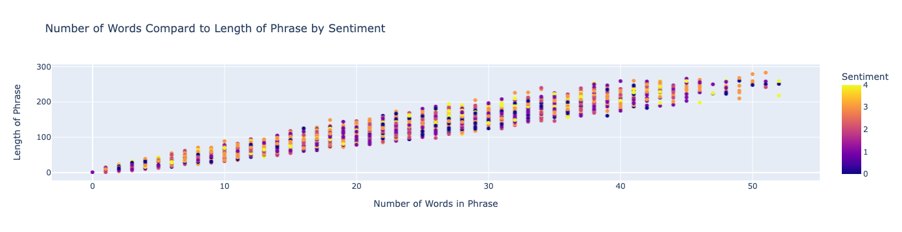
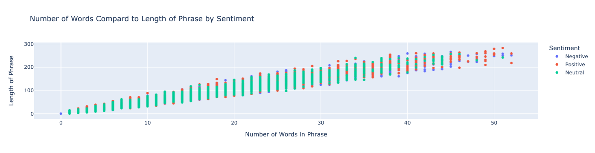
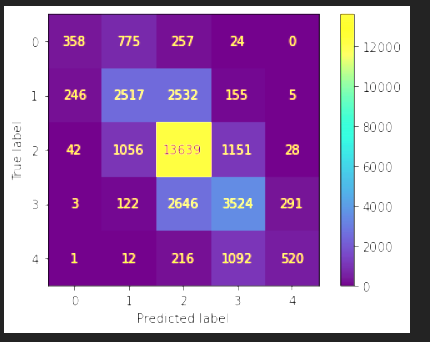
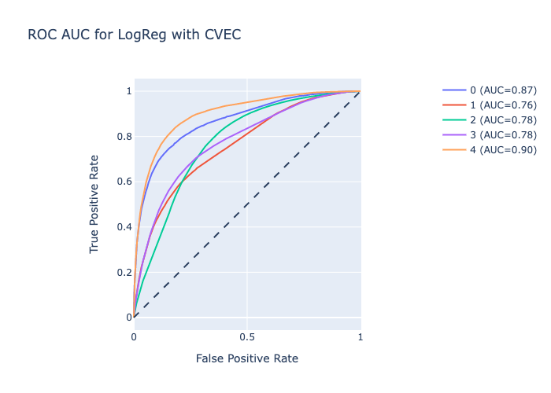

# Project 4: Choose Your Own Adventure

## Group Awesome: Curtis Hope Hill, Mary Schindler (McAteer), and Kathy Simon (alphabetical order) (Author: Mary Schindler)

From a list of possible Kaggle competitions, Group Awesome selected a NLP classification problem based on 'Sentiment Analysis on Movie Reviews', [Sentiment Analysis on Movie Reviews](https://www.kaggle.com/c/sentiment-analysis-on-movie-reviews). We followed the data science process: cleaning our data and performing EDA, as well as fiting and evaluating several models in order to find the best one. After comparing several models using both CountVectorizer and TF-IDFVectorizer to vectorize the given text, our group found that SupportVectorClassifier with TF-IDFVectorizer performed the best. 

## Dataset

- [Sentiment Analysis on Movie Reviews](https://www.kaggle.com/c/sentiment-analysis-on-movie-reviews) 

## Timeline - Completed Steps:

- **9am**: Project introduction.
- **10am**: By 10am, answer the [check-in form](https://forms.gle/HC3zUkuQfyNXG7iu9) with the dataset you've chosen.

## Timeline - Upcoming:

- **4:30pm**: 5-minute lightning talks where Group Awesome will walk you through the project. 
- **5pm**: Group Awesome will make sure the project work has been pushed.

### Data Cleaning and EDA

The group was giving training and testing data sets from Kaggle with no missing or null values. Our target value was 'Sentiment', which was scored on a scale 0 - 4. Those scores had the following normalized value_counts (our baseline model):

- 0 - negative, 0.045
- 1 - somewhat negative, 0.175
- 2 - neutral, 0.510
- 3 - somewhat positive, 0.211
- 4 - positive, 0.059

The scores were normally distributed with no outliers. While there no missing values that needed to be addressed, in order to properly determine the most frequent words, the duplicate instances of 'SentenceID' had to be removed. Limited cleaning was done to the data to perserve instances of exclaimations being used, uppercase being used, which would contribute to 'Sentiment'.

Additionally, as demonstrated by the above image, there were also no outliers in terms of word counts of reviews. Interestingly, there were trends amongst the length of a review and 'Sentiment':

### Preprocessing and Modeling

Our target variable in this instance was 'Sentiment'. We used 'Phrase' as the feature to help build our model.  Using both the vectorizer CountVectorizer and TF-IDFVectorizer, we explored different models (including but not limited to LogReg, MultinomialNB, etc.). All of the models were overfit.

For each model we generated a Classification Report and Confusion Matrix in order to evaluate the models. We found that TF-IDFVectorizer with SupportVectorClassifier performed the best at Train = 0.7743, Test = 0.6587.

As TF-IDF weights words in addition to counting them it makes sense it would produce a better model, especially based on a metric like 'Sentiment' for movie reviews. A downfall of this model, regrettably, is how long it takes to run compared to something more simple like LogReg

### Conclusion

While the group's model was not able to reach the industry benchmark of 80% accuracy, our model performed decently with approx. 66% accuracy among the 'Sentiment' labels 0 - 4. With additionally cleaning and pre-processing it is likely that we could have gotten a better score. Given the time constraint, however, forgoing additional text-data cleaning for attempting different types of models was worth it. Comparing our final model to our baseline model, we received the following scores for 'Sentiment'

- 0 - negative, 0.065
- 1 - somewhat negative, 0.0944
- 2 - neutral, 0.726
- 3 - somewhat positive, 0.1615
- 4 - positive, 0.017

All of the models we explored we overfit, including our final model. As stated above, likely additionaly cleaning and pre-processing such as adding additional stop words and lemmatization would have yielded more accurate results, including reducing bias. 

Given the time, provided however, Team Awesome is proud of their results. Kathy Simon was savy enough with plotly to get a working ROC AUC curve:

